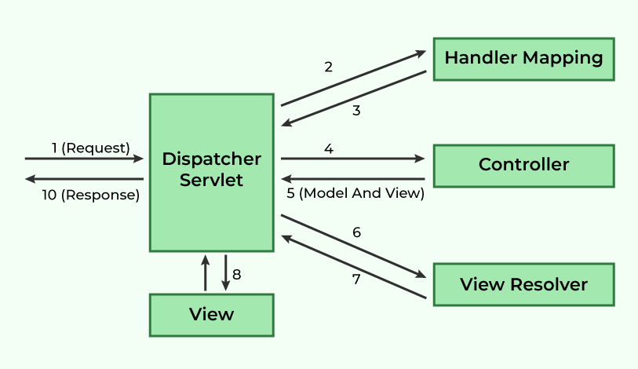

# Architecture
 [Home](README.md)

Dispatcher Servlet is the front controller that manages the entire HTTP request and response handling process. Now, the question is What is Front Controller? It is quite simple, as the name suggests, when any web requests are made, the requests will come first to the front Controller which is nothing but the Dispatcher Servlet. The Front Controller stands first that is why it’s name is like this. After the requests comes into this, the dispatcher servlet accepts the requests and decides which controller will be suitable to handle these requests. Then it dispatches the HTTP requests to specific controller.

__Spring Model-View-Controller Flow Diagram__

__Spring MVC Framework works as follows:__

1. All the incoming requests are intercepted by the DispatcherServlet that works as the front controller.
2. The DispatcherServlet then gets an entry of handler mapping from the XML file and forwards the request to the controller.
3. The object of ModelAndView is returned by the controller.
4. The DispatcherServlet checks the entry of the view resolver in the XML file and invokes the appropriate view component.

__Advantages of Spring MVC Framework__

1. The container is used for the development and deployment of applications and uses a lightweight servlet.
2. It enables rapid and parallel development.
3. Development of the application becomes fast.
4. Easy for multiple developers to work together.
5. Easier to Update the application.
6. It is Easier to Debug because we have multiple levels in the application.

Source :

[Link](https://www.geeksforgeeks.org/spring-mvc-framework/)